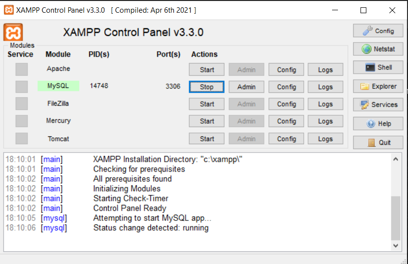

# Hospital-Jframe
Proyecto Hospitalario con Jframe java + Base de datos Workbeanch + Xamp!
<h2>Imagenes del Proyecto</h2>

<table align="left">
  <tr border="none">
    <td width="40%" align="center">
      

        
      

    </td>
    <td width="40%" align="center">
      

        
      

    </td>
  </tr>
  <tr border="none">
    <td width="40%" align="center">
      

        
      

    </td>
    <td width="40%" align="center">
      

        
      

    </td>
  </tr>
</table>

<h2>Información</h2>

Debes tener descargado Xamp para poder ejecutar el Proyecto
   Cada ventana de este proyecto tiene librerias que si no las
   agregas a tu proyecto puede que te salga error!

