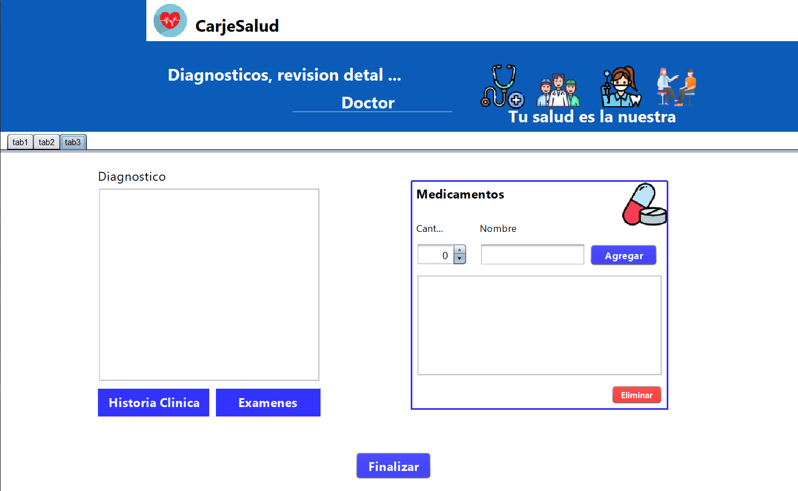

# Hospital-Jframe
Proyecto Hospitalario con Jframe java + Base de datos Workbeanch + Xamp!
<h2>Imagenes del Proyecto</h2>

<table align="left">
  <tr border="none">
    <td width="40%" align="center">
      

        
      

    </td>
    <td width="40%" align="center">
      

        
      

    </td>
  </tr>
  <tr border="none">
    <td width="40%" align="center">
      

        
      

    </td>
    <td width="40%" align="center">
      

        
      

    </td>
  </tr>
</table>

<h2>Información</h2>

Debes tener descargado Xamp para poder ejecutar el Proyecto
   Cada ventana de este proyecto tiene librerias que si no las
   agregas a tu proyecto puede que te salga error! 

   🚨OJO!🚨
   Ten en cuenta que en algunas ventanas no se podrán ejecutar
   en particular, queriendo ejecutar solo una ventana, como lo es
   la ventana del Doctor, que esta nombrada como ¨VentanaD¨, 
   se puede ejecutar y ver su contenido, ejecutando el Login que
   es la ventana principal y asi accesediendo a esta ventana!!!!

 <h1>Descargar precionando en el Iconos👇👇👇</h1>  
 

        

